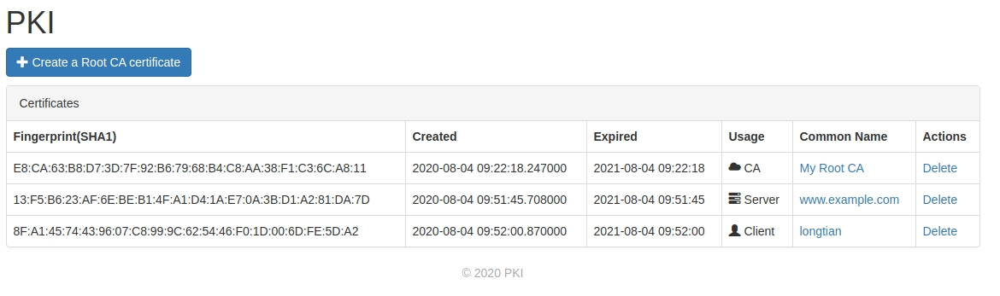

# PKI

基于 Flask 和 Cryptography 开发的证书管理系统

## 截图

- [x] 证书列表
- [x] 创建证书
- [ ] <del>延长证书</del>
- [x] 删除证书
- [x] 吊销证书
- [x] 证书详情
- [x] 证书状态
- [x] PEM 格式导出
- [x] DER 格式导出
- [x] pkcs12 格式导出
- [ ] i18n 支持
- [ ] 用户管理
- [ ] RBAC 权限
- [ ] UWSGI
- [x] Docker 镜像
- [x] 吊销列表
- [ ] 时区支持
- [x] OCSP 查询
- [x] 上传 PEM 证书
- [x] 上传 DER 证书
- [x] 下载证书
- [x] 扫描证书
- [ ] 透明度记录
- [ ] 证书策略
- [x] 树形结构
- [ ] 读取本地 ROOT 证书列表
- [ ] OCSP 主动查询
- [ ] CSR 签发请求支持